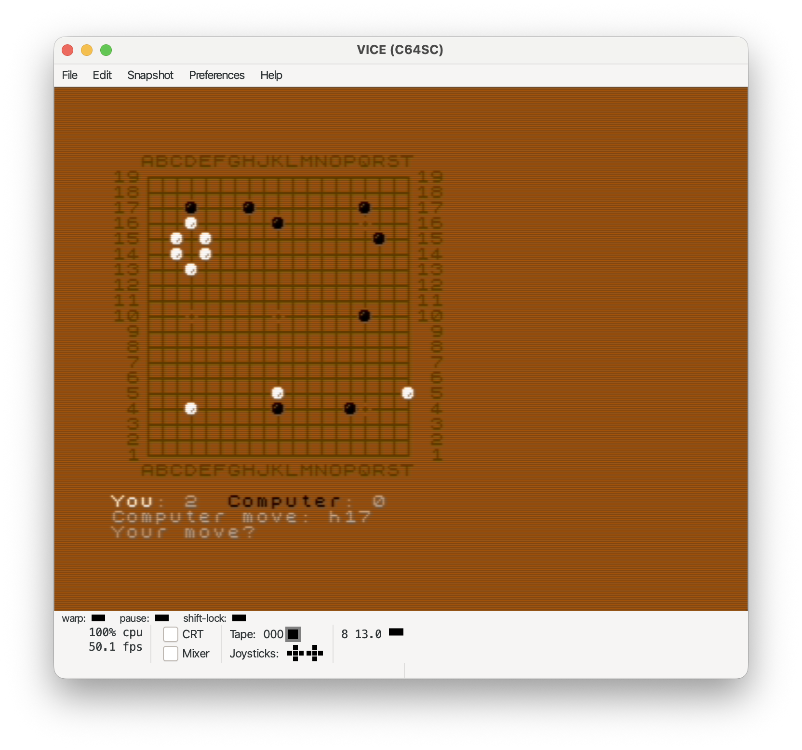

# GNUGO C64

GNUGO v1.2 - Commodore 64 port using the [oscar64](https://github.com/.../) C compiler.

Go (Wei-Chi) board game for the Commodore 64.

## Requirements

- [oscar64](https://github.com/.../) C cross-compiler (in `$PATH`)
- `zxfonttr.bin` - ZX Spectrum font bitmap (included)

## Build

```sh
make c64
```

Produces `gnugo.prg` (approx. 26 KB) with size optimization (`-Os`).

## Run

Transfer `gnugo.prg` to your C64 (via SD card, disk, or emulator) and load:

```
LOAD"GNUGO.PRG",8,1
RUN
```

## Screenshot



### Controls

| Command | Action |
|---|---|
| `A1`..`T19` | Place stone at column, row |
| `pass` | Pass turn |
| `stop` | End game and score |

Column letters: `A B C D E F G H J K L M N O P Q R S T` (no `I`).

## Files

| File | Description |
|---|---|
| `main.c` | C64 entry: PETSCII init, font, game loop |
| `fontdata.c` | Custom 8x8 font loader (RAM under ROM at $A000) |
| `count.c` | Liberty counting (iterative stack) |
| `findnext.c` | Next-move search (iterative stack) |
| `findopen.c` | Open-space search (iterative stack) |
| `getmove.c` | Human input (save disabled on C64) |
| `showbord.c` | 40-column compact board display |
| `showinst.c` | Instructions (disabled - saves ~1 KB) |
| `gnugo.h` | Common header and prototypes |

## License

GNU General Public License v2. See `COPYING`.
